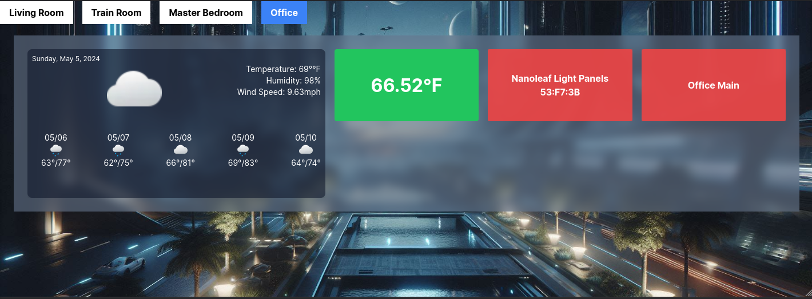

# Next.js Dashboard

This is a dashboard built with Next.js, Tailwind CSS, and TypeScript. It displays various widgets, currently a light widget, temperature widget, forecast widget, and clock widget. The widgets are organized in a grid layout with a maximum of 5 columns. Widgets can span multiple columns and rows, and they automatically move to the next row if there are more widgets than columns. Feel free to point out issues and/or expand the functionality. 



## Docker Images

The Docker images for this dashboard are available on Docker Hub:

- For amd64: `mra2414/nextjs-hadash:latest`
- For arm64: `mra2414/nextjs-hadash:latest-arm64`

You can pull the Docker images with the following commands:

```bash
# For amd64
docker pull mra2414/nextjs-hadash:latest

# For arm64
docker pull mra2414/nextjs-hadash:latest-arm64
```

## Running the Dashboard
To run the dashboard, you can use the following command:

```bash
docker run -e NEXT_PUBLIC_HASS_URL='your_hass_url' -e NEXT_PUBLIC_HASS_TOKEN='your_hass_token' -p 3000:3000 mra2414/nextjs-hadash:latest
```

Then, open your web browser and navigate to http://localhost:3000.

## Customizing the Dashboard

The dashboard is customizable. You can change the tabs and the entities displayed on each tab by modifying the `tabs.ts` file.

The `tabs.ts` file contains an array of tab objects. Each tab object has a `name` property, which is the name of the tab, and an `entities` property, which is an array of entity objects. Each entity object represents a widget on the tab.

Here's an example of a tab object:

```typescript
{
    name: 'Living Room',
    entities: [
        {widgetType: 'ClockWidget', col: 2, row: 2, colOffset: 0, rowOffset: 0},
        {entityId: 'weather.home', widgetType: 'ForecastWidget', col: 2, row: 2, colOffset: -2, rowOffset: 2},
        {entityId: 'sensor.living_room_temperature', widgetType: 'TemperatureWidget', col: 1, row: 1, colOffset: 0, rowOffset: 0},
        {entityId: 'light.table_lamp_door', widgetType: 'LightWidget', col: 1, row: 1, colOffset: 0, rowOffset: 0},
        {entityId: 'light.sconce', widgetType: 'LightWidget', col: 1, row: 1, colOffset: 0, rowOffset: 0},
    ],
}
```
In this example, the Living Room tab has a clock widget, a forecast widget, a temperature widget, and two light widgets.

To add a new tab, add a new object to the tabs array. To add a new widget to a tab, add a new object to the entities array of the tab.

Each entity object has the following properties:

widgetType: The type of the widget. This can be 'ClockWidget', 'ForecastWidget', 'TemperatureWidget', or 'LightWidget'.
col and row: The number of columns and rows the widget spans.
colOffset and rowOffset: The number of columns and rows the widget is offset from the top-left corner of the tab.
entityId (optional): The ID of the entity the widget is associated with. This is required for 'ForecastWidget', 'TemperatureWidget', and 'LightWidget'.
You can modify these properties to customize the layout and content of your dashboard.
